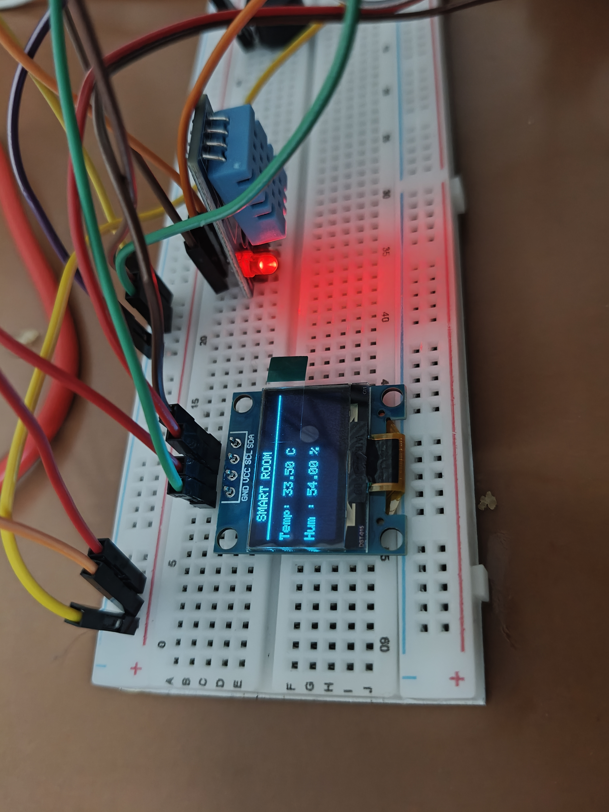
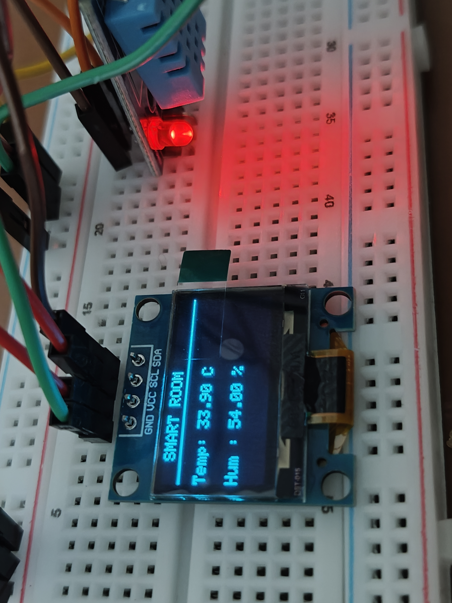

# ESP32 Smart Room Monitoring System

## Overview

This project uses an ESP32, DHT11 sensor, OLED display, and buzzer to monitor room conditions.

Features:
- Temperature monitoring
- Humidity monitoring
- OLED display output
- Buzzer alert when temperature exceeds threshold

## Components Used

- ESP32 Dev Module
- DHT11 Temperature & Humidity Sensor
- SSD1306 OLED Display (I2C)
- Buzzer
- Breadboard
- Jumper Wires

## Wiring

### DHT11

| DHT11 | ESP32 |
|--------|--------|
| VCC | 3V3 |
| GND | GND |
| DATA | D4 |

### OLED

| OLED | ESP32 |
|--------|--------|
| VCC | 3V3 |
| GND | GND |
| SDA | D21 |
| SCL | D22 |

### Buzzer

| Buzzer | ESP32 |
|--------|--------|
| + | D2 |
| - | GND |

## Working

- DHT11 measures temperature and humidity.
- ESP32 reads sensor values.
- OLED displays live readings.
- Buzzer activates when temperature exceeds the set threshold.

## Project Photos

## Author

Sarthak Chitnis
